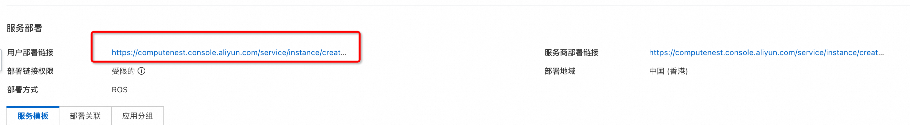
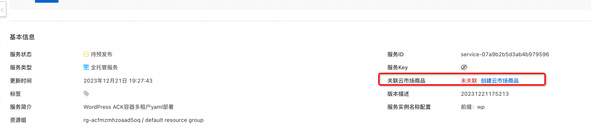
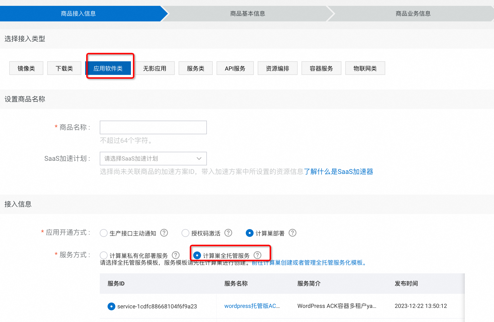
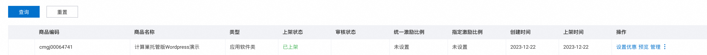
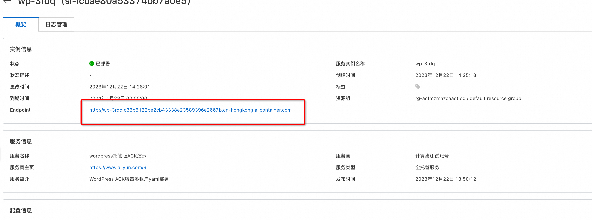

# 服务模板说明文档

## 服务说明

本文介绍容器服务部署wordpress实现托管版多租户的流程，本示例对应的Git仓库地址：[wordpress-managed-ack-demo](https://github.com/aliyun-computenest/wordpress-managed-ack-demo)。

根据该服务模板构建的服务默认包含三种套餐：

| 套餐名  | vCPU   | 内存    | 存储     | 副本数 | 
|--------|--------|-------|--------|---|
| 低配版 | 300m   | 512Mi | 20Gi   | 1 |
| 基础版 | 600m   | 1Gi   | 40Gi   | 2 |
| 高配版 | 1      | 2Gi   | 80Gi   | 3 |

本示例需要提前准备容器集群，需要到[容器服务控制台](https://cs.console.aliyun.com/) 提前创建。
本示例创建过程大约持续1分钟，当服务变成待提交后构建成功。

## 服务架构

本部署架构为容器多租户部署，架构如下图所示：
1. 使用ingress根据域名路由到各个租户的wordpress
2. 每个租户一个k8s namespace，用namespace隔离
3. wordpress和mysql使用Helm部署
4. 这个示例中的域名采用了本地域名，需要用户手动添加本地域名和slb ip的映射。

## 服务构建计费说明

测试本服务构建无需任何费用，创建服务实例涉及的费用参考服务实例计费说明。

## 服务实例计费说明

测试本服务在计算巢上的费用主要涉及：

- 导入的容器集群的费用
- 在容器集群新建的磁盘、网络等费用

## 服务实例部署流程

### 部署参数说明

| 参数组         | 参数项    | 说明                                             |
|-------------|--------|------------------------------------------------|
| 服务实例        | 服务实例名称 | 长度不超过64个字符，必须以英文字母开头，可包含数字、英文字母、短划线（-）和下划线（_）。 |
|             | 地域     | 服务实例部署的地域                                      |

### 部署步骤

0. 部署链接
 
1. 单击部署链接，进入服务实例部署界面，根据界面提示，填写参数完成部署。
 
2. 参数填写完成后可以看到对应询价明细，确认参数后点击**下一步：确认订单**。
3. 确认订单完成后同意服务协议并点击**立即创建**。
   进入待部署阶段。
    
4. 在用户侧进入待部署状态后需要服务商同意用户的部署。
    
    
5. 等待部署完成后就可以开始使用服务，进入服务实例详情点击Endpoint。这里使用的是本地域名，需要在hosts中添加本地域名和slb的映射，然后使用这个域名访问服务。
    

## 售卖配置
当前服务因为没有配置售卖链路，所以用户侧部署时候需要服务商的二次确认，当服务上架到阿里云云市场后，就可以不经过服务商的二次确认就可以完成部署。

1. 计算巢服务审核上线。
    上到云市场的商品需要在计算巢这里完成上架过程，走通预发布和发布流程，经过审核后上线。
    
2. 点击到云市场创建商品，选择类目SaaS服务计算巢托管版。
    
    
3. 按要求添商品信息。
4. 在销售信息时候选择预付费模式，并配置三个套餐，给三个套餐配置相应的价格。
    
    
5. 完成商品上线和审核。
    
6. 到计算巢完成套餐和云市场商品的绑定 (如果名字一样会自动匹配上，可以忽略这个步骤)。
    
    
7. 完成部署。
    
    
    
    
8. 至此完成了一个托管版上到云市场并使用的全过程。

# 更多功能

## 计量计费

[自定义服务架构图](https://help.aliyun.com/zh/compute-nest/customize-a-service-architecture?spm=a2c4g.11186623.0.0.56e736bfyUdlFm])

[服务文档上线流程](https://help.aliyun.com/zh/compute-nest/use-cases/publish-documents-to-compute-nest?spm=a2c4g.313309.0.i0])

[将服务上架云市场并上到云市场售卖](https://help.aliyun.com/zh/compute-nest/publish-a-service-to-alibaba-cloud-marketplace?spm=a2c4g.11186623.0.i7])

## 服务配置

[创建代运维服务完成实例运维](https://help.aliyun.com/zh/compute-nest/create-a-hosted-operations-and-maintenance-service?spm=a2c4g.11186623.0.i24#task-2167552])

[创建包含变配功能的服务](https://help.aliyun.com/zh/compute-nest/use-cases/create-a-service-that-supports-specification-changes-and-change-the-specifications-of-a-service-instance?spm=a2c4g.11186623.0.i3])

[创建包含服务升级功能的服务](https://help.aliyun.com/zh/compute-nest/upgrade-a-service-instance?spm=a2c4g.11186623.0.i17#task-2236803)